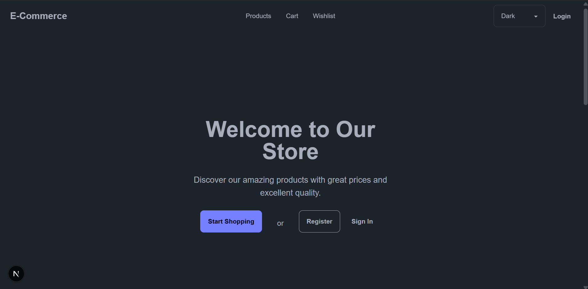
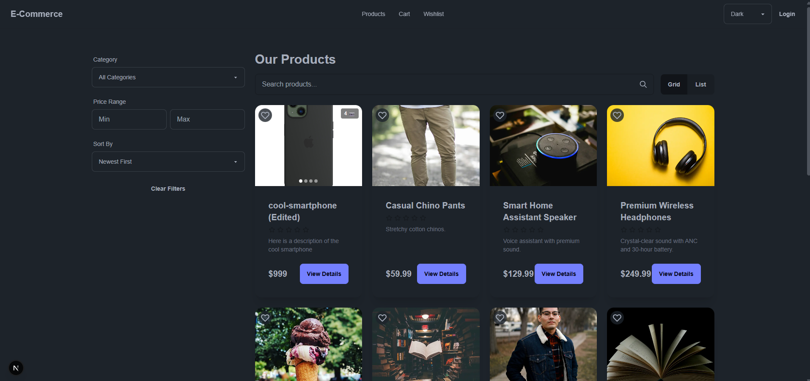
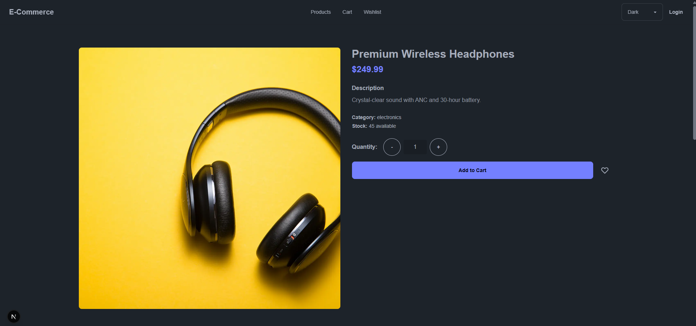
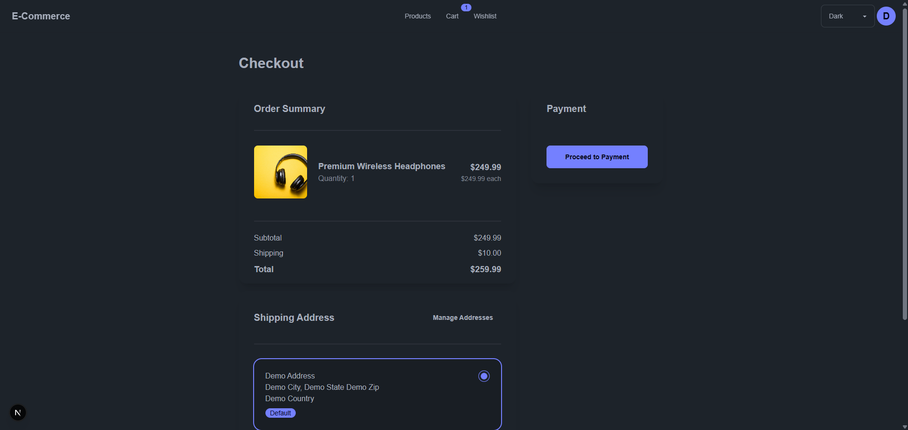
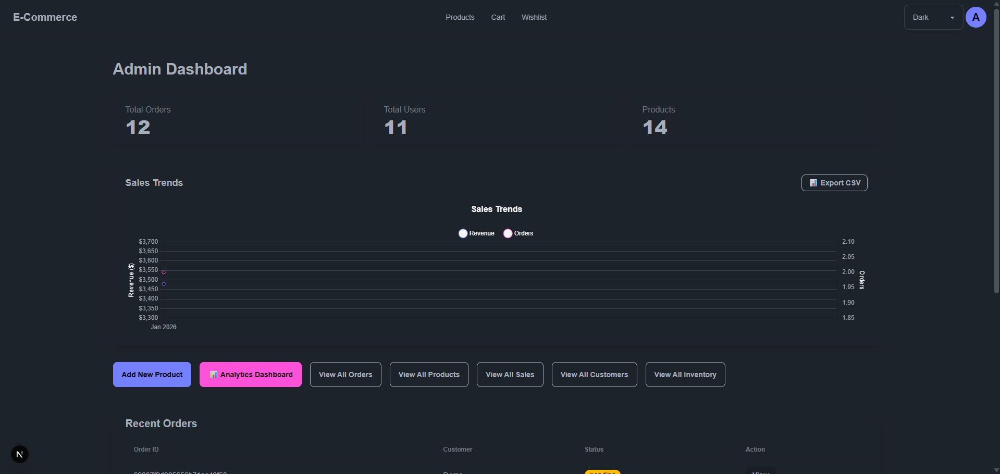
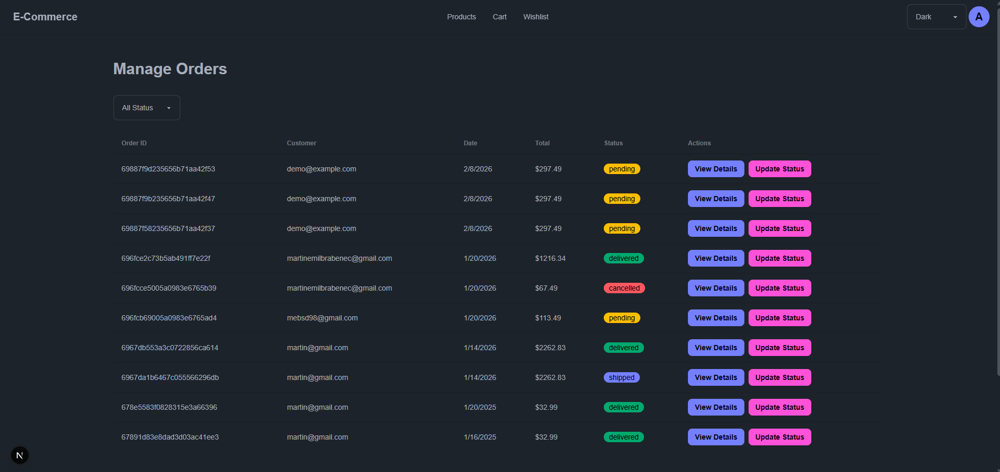
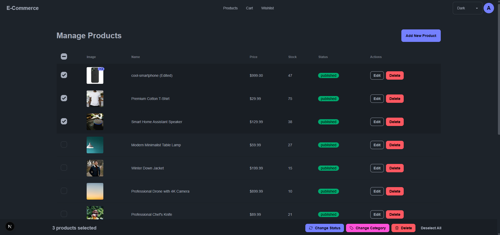
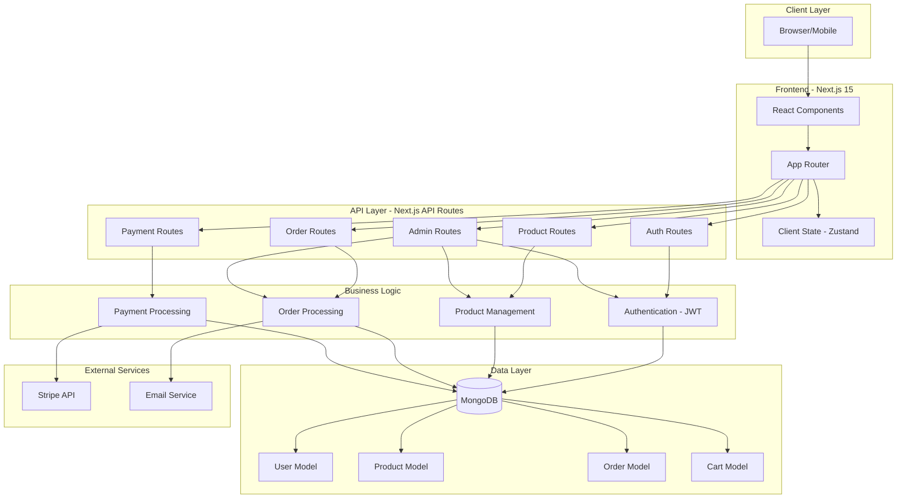
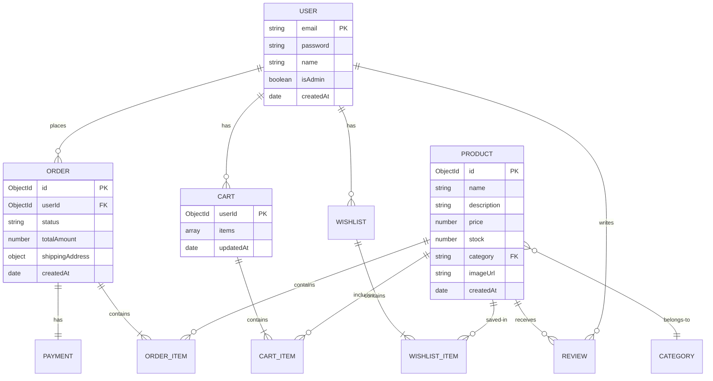
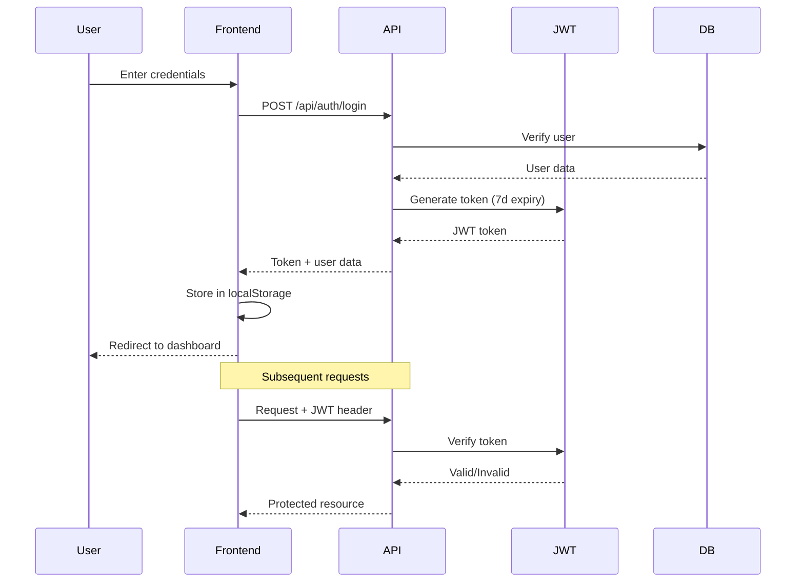

# 🛒 E-Commerce Platform

[](https://github.com/mrmartin1998/e-commerce-platform/actions)
[](https://nextjs.org/)
[](https://reactjs.org/)
[](https://mongodb.com/)
[](https://stripe.com/)

> **🚀 [Live Demo](https://e-commerce-platform-three.vercel.app/)** | **📋 [Project Board](https://github.com/mrmartin1998/e-commerce-platform/projects)** | **🔧 [Issues](https://github.com/mrmartin1998/e-commerce-platform/issues)**

A **production-ready e-commerce platform** built with enterprise-grade development practices. This project demonstrates full-stack development capabilities, professional workflow execution, and modern web application architecture.
---

## 📑 Table of Contents

- [Project Overview](#-project-overview)
- [Live Demo](#-live-demo)
- [Screenshots](#-screenshots)
- [Professional Development Process](#-professional-development-process)
- [Core Features & Capabilities](#-core-features--capabilities)
- [System Architecture](#️-system-architecture)
- [Technical Stack](#️-technical-stack)
- [Quick Start Guide](#-quick-start-guide)
- [Testing & Quality Assurance](#-testing--quality-assurance)
- [Current Development Status](#-current-development-status)
- [Deployment & Production](#-deployment--production)
- [Professional Project Structure](#-professional-project-structure)
- [Skills Demonstrated](#-skills-demonstrated)
- [Contact & Professional Links](#-contact--professional-links)
- [Development Roadmap](#-development-roadmap)

---
## � Project Overview

### The Problem
Modern e-commerce requires more than just a shopping cart. Businesses need a comprehensive platform that handles everything from inventory management to payment processing, while providing customers with a seamless, mobile-friendly experience. Many existing solutions are either too complex for small businesses or too limited for growth.

### The Solution
A **full-stack e-commerce platform** that combines:
- **Customer-First Design**: Intuitive shopping experience with real-time cart updates, secure checkout, and order tracking
- **Powerful Admin Tools**: Complete product management, order processing, and business analytics in one dashboard
- **Enterprise Workflow**: Professional development practices including GitFlow, CI/CD, and comprehensive testing
- **Mobile-Optimized**: Responsive design ensuring perfect experience on all devices
- **Production-Ready**: Secure authentication, payment processing, and deployment-ready architecture

### Key Differentiators
- ✅ **Real-world Business Logic**: Not just a tutorial project - includes inventory tracking, order management, and analytics
- ✅ **Professional Workflow**: Demonstrates enterprise-level development practices and team collaboration
- ✅ **Modern Tech Stack**: Built with latest Next.js 15, React 19, and industry-standard tools
- ✅ **Complete Feature Set**: From authentication to payments, everything works together seamlessly

---

## 🎬 Live Demo

**Try it yourself:** [e-commerce-platform-three.vercel.app](https://e-commerce-platform-three.vercel.app/)

### Demo Credentials

#### Customer Account
```
Email: demo@customer.com
Password: Demo123!
```
*Explore shopping features, cart functionality, and order tracking*

#### Admin Account
```
Email: admin@ecommerce.com
Password: Admin123!
```
*Access full admin dashboard with analytics, product management, and order processing*

> **Note**: Demo data is reset periodically. Feel free to create test orders and explore all features!

---

## 📸 Screenshots

### 🏠 Homepage & Product Browsing

#### Desktop Experience

*Hero section with clear call-to-action buttons and responsive navigation*


*Continue Shopping section with recently viewed products*

- [x] Hero section with CTA buttons
- [x] Recently viewed products grid
- [x] Responsive navigation

#### Mobile Experience
<!-- TODO: Add screenshot - Homepage mobile view (iPhone SE) -->
<!--  -->
- [ ] Mobile-optimized hero
- [ ] Touch-friendly navigation
- [ ] 2-column product grid

---

### 🛍️ Products & Search

#### Product Grid with Filters

*Advanced product browsing with category filters, price range, search, and sort options*

- [x] Product grid layout
- [x] Category filters
- [x] Search functionality

#### Mobile Product Browsing
<!-- TODO: Add screenshot - Mobile products with collapsible filters -->
<!--  -->
- [ ] Collapsible filters
- [ ] Responsive grid
- [ ] Touch-optimized controls

---

### 📦 Product Details

#### Product Page Desktop

*Product detail page with large image, pricing, stock information, and quantity controls*

- [x] Product information
- [x] Quantity selector
- [x] Add to cart functionality
- [ ] Image gallery with thumbnails
- [ ] Reviews section

#### Product Page Mobile
<!-- TODO: Add screenshot - Product detail mobile -->
<!--  -->
- [ ] Mobile-responsive layout
- [ ] Touch-friendly controls
- [ ] Swipeable image gallery

---

### 🛒 Shopping Flow

#### Shopping Cart

*Shopping cart with product images, quantity controls, order summary, and checkout flow*

- [x] Cart items with images
- [x] Quantity adjustment
- [x] Real-time total calculation
- [x] Continue shopping / Checkout CTAs

#### Checkout Process

*Checkout page with order summary, shipping address selection, and payment flow*

- [x] Shipping information form
- [x] Order summary (collapsible on mobile)
- [ ] Stripe payment integration
- [x] Form validation

#### Order Confirmation

*Order success page with confirmation message, order summary, and next steps*

- [x] Order success message
- [x] Order details and tracking

---

### 🎛️ Admin Dashboard

#### Analytics Dashboard

*Admin analytics dashboard with revenue charts, sales trends, and business intelligence*

- [x] Revenue charts (Chart.js)
- [x] Sales trends
- [x] Top products
- [x] Key performance metrics

#### Order Management

*Order management dashboard with status filtering, order tracking, and bulk actions*

- [x] Orders table/cards
- [x] Status filtering
- [x] Order details view
- [x] Status update controls

#### Product Management

*Product management interface with CRUD operations, bulk selection, and inventory tracking*

- [x] Product list
- [x] Add/Edit product modal
- [x] Image upload
- [x] Bulk operations

#### Bulk Operations
*Bulk operations are integrated into the Product Management interface shown above*

- [x] Select multiple products
- [x] Bulk edit modal
- [x] Confirmation dialogs

---

### 📱 Mobile Optimization

#### Before/After Comparison
<!-- TODO: Add screenshot - Mobile optimization comparison -->
<!--  -->
- [ ] Side-by-side comparison
- [ ] Touch target improvements
- [ ] Responsive grid enhancements

#### iPhone SE Optimization
<!-- TODO: Add screenshot - iPhone SE view -->
<!--  -->
- [ ] Small screen optimization
- [ ] Touch-friendly buttons
- [ ] Readable typography

---

## 💼 Professional Development Process

This project showcases **enterprise-level development practices** including:

- **🔄 GitFlow Workflow** - Feature branches, code reviews, protected main branches
- **📋 Issue-Driven Development** - Structured project management with comprehensive templates
- **✅ Automated CI/CD** - GitHub Actions with automated testing and build verification  
- **📝 Professional Code Review** - Detailed PR templates with security and quality checklists
- **🛡️ Quality Assurance** - Comprehensive error handling and professional testing standards
- **📚 Documentation Standards** - Clear setup guides and contributor workflows
- **🔒 Security-First Approach** - JWT authentication, input validation, and secure practices

### Development Workflow
```bash
# Professional GitFlow implementation
git checkout develop
git checkout -b feature/new-feature-name
# ... implement feature with proper testing
# ... create PR using professional template
# ... code review process with checklist
# ... merge to develop following standards
```

## ✨ Core Features & Capabilities

### 🛍️ Customer Experience
- **🔐 Secure Authentication System**
  - JWT-based login/register with bcrypt password hashing (7-day token expiration)
  - Protected routes with middleware authentication
  - Session persistence and automatic token validation
  - Secure password reset flow
  - Persistent login sessions across browser restarts

- **🛒 Complete Shopping Experience**
  - Product browsing with professional grid/list layouts
  - Real-time shopping cart with instant updates
  - Persistent cart state across browser sessions
  - Stock validation and inventory tracking
  - Seamless checkout flow with address management

- **💳 Secure Payment Processing**
  - Full Stripe integration with test/production modes
  - Secure payment intent creation and confirmation
  - Order confirmation with detailed receipts
  - Email notifications for order updates

- **👤 User Profile Management**
  - Comprehensive user dashboard
  - Order history with detailed tracking
  - Profile editing with validation
  - Address book management

### 🎛️ Administrative Dashboard
- **📦 Product Management System**
  - Complete CRUD operations with image upload
  - Real-time inventory tracking and stock alerts
  - Product categorization and organization
  - Bulk operations for efficiency

- **📊 Order Management Hub**
  - Real-time order processing dashboard
  - Order status tracking and updates
  - Customer information management
  - Detailed order analytics

- **📈 Advanced Analytics Dashboard**
  - **Sales Analytics**: Revenue tracking, sales trends, top products
  - **Customer Insights**: User behavior, demographics, purchase patterns
  - **Inventory Analytics**: Stock levels, turnover rates, category performance
  - **Performance Metrics**: Real-time KPIs and business intelligence

## 🏗️ System Architecture

### High-Level Architecture



### Data Model Relationships



### Authentication Flow



---

## 🛠️ Technical Stack

### Frontend Stack
- **⚡ Next.js 15.0.3** - App Router with Server Components and advanced caching
  - *Why?* Industry-leading React framework with excellent performance and SEO
- **⚛️ React 19** - Latest concurrent features and modern hooks
  - *Why?* Modern component architecture with improved performance
- **🎨 TailwindCSS + DaisyUI** - Professional component library with dark/light themes
  - *Why?* Rapid UI development with consistent design system
- **📱 Responsive Design** - Mobile-first approach with full accessibility
  - *Why?* 60%+ of e-commerce traffic comes from mobile devices

### Backend & Database
- **🚀 Next.js API Routes** - Serverless architecture with middleware
  - *Why?* Unified codebase, automatic API optimization, serverless deployment
- **🍃 MongoDB + Mongoose** - Document database with professional schema design
  - *Why?* Flexible schema for product variants, excellent scalability
- **🔒 JWT Authentication** - Secure token-based auth (7-day session duration)
  - *Why?* Stateless authentication, scalable across serverless functions
- **🛡️ Input Validation** - Comprehensive data validation and sanitization
  - *Why?* Security-first approach prevents injection attacks

### Payment & Integration
- **💳 Stripe Integration** - Production-ready payment processing
  - *Why?* Industry standard, excellent documentation, PCI compliant
- **📧 Email Services** - Automated transactional emails
  - *Why?* Essential for order confirmations and user communication
- **☁️ Vercel Deployment** - Edge network with automatic scaling
  - *Why?* Optimal Next.js hosting with zero-config deployment

### Development & DevOps
- **🧪 Vitest** - Modern testing framework with excellent DX
  - *Why?* Fast, TypeScript-friendly, better than Jest for modern projects
- **🔄 GitHub Actions CI/CD** - Automated testing, building, and deployment verification
  - *Why?* Free for public repos, seamless GitHub integration
- **📊 ESLint + Prettier** - Consistent code quality and formatting
  - *Why?* Industry standard for maintaining code quality
- **🔀 GitFlow Workflow** - Professional branching strategy with PR reviews
  - *Why?* Team-ready workflow, demonstrates collaborative development skills

## 🚀 Quick Start Guide

### Prerequisites
```bash
Node.js 18.x or higher
MongoDB (local or Atlas)
Stripe account for payments
Git for version control
```

### Installation & Setup

1. **Clone and Install**
   ```bash
   git clone https://github.com/mrmartin1998/e-commerce-platform.git
   cd e-commerce-platform
   npm install
   ```

2. **Environment Configuration**
   ```bash
   cp env.example .env.local
   # Edit .env.local with your configuration
   ```

3. **Environment Variables**
   ```env
   # Database
   MONGODB_URI=mongodb://localhost:27017/ecommerce-platform
   
   # Authentication
   JWT_SECRET=your-super-secret-jwt-key-minimum-32-characters
   JWT_EXPIRES_IN=7d
   
   # Stripe (use test keys for development)
   STRIPE_PUBLISHABLE_KEY=pk_test_your_stripe_publishable_key
   STRIPE_SECRET_KEY=sk_test_your_stripe_secret_key
   STRIPE_WEBHOOK_SECRET=whsec_your_webhook_secret
   
   # Application
   NEXT_PUBLIC_APP_URL=http://localhost:3000
   NODE_ENV=development
   ```

4. **Start Development**
   ```bash
   npm run dev
   ```

5. **Access Application**
   - **Frontend**: http://localhost:3000
   - **Admin Panel**: http://localhost:3000/admin
   - **API**: http://localhost:3000/api

## 🧪 Testing & Quality Assurance

### Current Implementation
```bash
# Development
npm run dev          # Start development server
npm run build        # Production build
npm run start        # Production server

# Code Quality
npm run lint         # ESLint code analysis
npm run lint:fix     # Auto-fix linting issues
```

### Professional Standards
- **Code Review Process**: All changes reviewed via PR templates
- **Security Checklists**: Comprehensive security validation
- **Error Handling**: Professional error boundaries and user feedback
- **Performance**: Optimized builds and caching strategies

## 📊 Current Development Status

### ✅ Implemented Features
- **Authentication**: Complete JWT system with protected routes
- **Product Management**: Full CRUD with image upload and inventory
- **Shopping Cart**: Real-time cart with persistence
- **Payment Processing**: Stripe integration with order creation
- **Admin Dashboard**: Product, order, and analytics management
- **Analytics**: Sales, customer, and inventory insights
- **Responsive UI**: Professional mobile-first design

### 🚧 Active Development
Based on your test checklist and roadmap:
- **Enhanced Search & Filtering**: Advanced product discovery
- **Cart Persistence**: localStorage fallback for guest users
- **Order Tracking**: Real-time status updates
- **Performance Optimization**: Image lazy loading and caching
- **Test Coverage**: Comprehensive testing suite

### 🔄 Known Issues Being Addressed
- **Token Expiration**: Implementing refresh token mechanism
- **Cart Images**: Product image display in cart components
- **Performance**: General application speed optimization

## 🚢 Deployment & Production

### Production Ready Features
- **Environment Management**: Proper development/production separation
- **Security Implementation**: JWT, input validation, CORS handling
- **Error Handling**: Professional error boundaries and logging
- **Performance Optimization**: Next.js optimization and caching

### Deployment Platforms
- **✅ Vercel** - Recommended for Next.js applications
- **✅ AWS/DigitalOcean** - Full control deployment options

## 📚 Professional Project Structure

```
src/
├── app/                    # Next.js App Router
│   ├── admin/             # Admin dashboard pages
│   ├── api/               # API routes and endpoints
│   ├── auth/              # Authentication pages
│   ├── cart/              # Shopping cart page
│   ├── products/          # Product browsing
│   └── profile/           # User profile management
├── components/            # Reusable UI components
│   ├── admin/            # Admin-specific components
│   ├── auth/             # Authentication components
│   ├── cart/             # Cart-related components
│   ├── layout/           # Layout and navigation
│   ├── product/          # Product display components
│   └── ui/               # Base UI components
├── lib/                  # Utilities and configuration
│   ├── db/              # Database connection and models
│   ├── middleware/       # Authentication and validation
│   └── utils/           # Helper functions
└── store/               # State management (Context API)

.github/                 # Professional development workflows
├── ISSUE_TEMPLATE/      # Comprehensive issue templates
├── workflows/           # CI/CD automation
└── pull_request_template.md
```

## 🤝 Professional Development Process

This project demonstrates **enterprise-ready development practices**:

### Project Resources
- 📋 [Branch Strategy](.github/BRANCH_STRATEGY.md) - GitFlow workflow implementation
- 📝 [Issue Templates](.github/ISSUE_TEMPLATE/) - Bug reports and feature requests
- 🔄 [Pull Request Template](.github/pull_request_template.md) - Code review checklist
- ⚡ [CI/CD Workflows](.github/workflows/) - Automated testing and deployment

### Issue-Driven Development
- **Bug Reports**: Structured templates with severity levels
- **Feature Requests**: Comprehensive planning templates
- **Task Management**: Organized project tracking

### GitFlow Implementation
- **Protected Branches**: Master and develop branch protection
- **Feature Branches**: Structured feature development
- **Code Reviews**: Mandatory PR reviews with checklists
- **Quality Gates**: Automated CI/CD validation

### Documentation Standards
- **Setup Guides**: Comprehensive onboarding documentation
- **API Documentation**: Clear endpoint documentation
- **Contribution Guidelines**: Professional contributor workflows

## 🎯 Skills Demonstrated

### Technical Competencies
- ✅ **Full-Stack Development** - End-to-end application development
- ✅ **Modern React/Next.js** - Latest features and best practices
- ✅ **Database Design** - Professional MongoDB schema architecture
- ✅ **API Development** - RESTful design with proper error handling
- ✅ **Payment Integration** - Production-ready Stripe implementation
- ✅ **Authentication & Security** - JWT, validation, secure practices

### Professional Practices
- ✅ **Enterprise Workflow** - GitFlow, code reviews, CI/CD
- ✅ **Project Management** - Issue tracking, structured development
- ✅ **Quality Engineering** - Testing strategies, error handling
- ✅ **Documentation** - Professional setup and API guides
- ✅ **User Experience** - Responsive design, loading states
- ✅ **Production Deployment** - Environment management, optimization

## 📞 Contact & Professional Links

**Martin Emil Brabenec** - Full-Stack Developer  
- 🌐 **Portfolio**: [martin-emil-brabenec.vercel.app](https://martin-emil-brabenec.vercel.app)
- 💼 **LinkedIn**: [Professional Profile](https://www.linkedin.com/in/martin-emil-brabenec-33b818148/)
- 📧 **Email**: martinemilbrabenec@gmail.com
- 🐙 **GitHub**: [@mrmartin1998](https://github.com/mrmartin1998)

---

## 🚀 Development Roadmap

### Current Phase: Core Feature Enhancement
- Enhanced search and filtering system
- Cart persistence optimization
- Performance improvements
- Comprehensive testing suite

### Next Phase: Advanced Features
- Product reviews and ratings
- Wishlist functionality
- Order tracking system
- Advanced analytics dashboard

### Future Enhancements
- Mobile app development
- Multi-vendor marketplace
- Advanced inventory management
- Machine learning recommendations

---

*This project represents professional-grade e-commerce development with enterprise workflow implementation. Built to demonstrate full-stack development capabilities and team-ready development practices.*